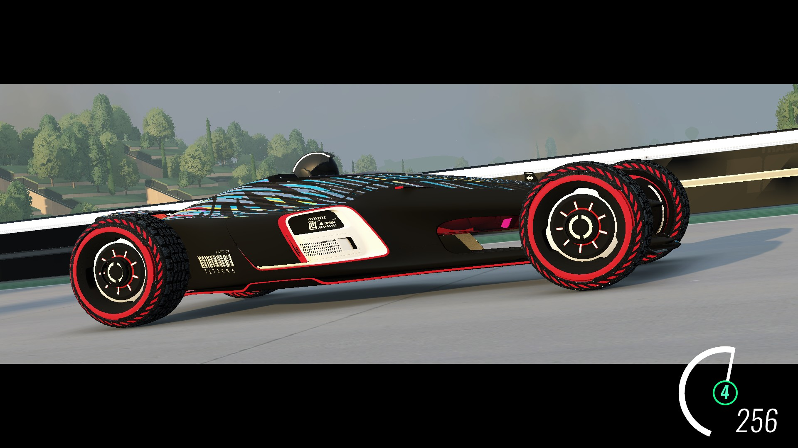
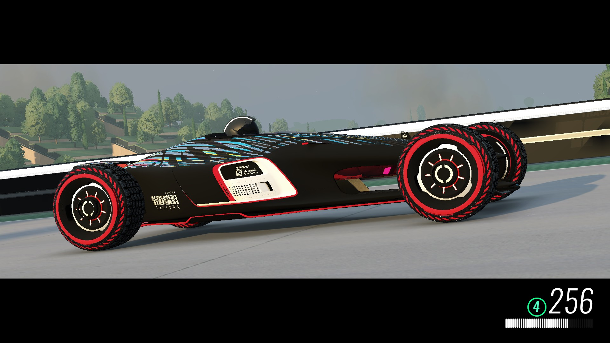

# Speedometer Dashboard for Openplanet

This plugin brings a speedometer dashboard with the RPM gauge, a gear indicator and the speed.

Different themes are included, and you can create your own! ([see here](src/Themes/README.md))

This plugin was created for the [Project Horizon](https://trackmania.exchange/s/tr/65123) - a map by MCYCShadow, that brings the Horizon speedometer!

## Themes:

### Basic

### BasicDigital

